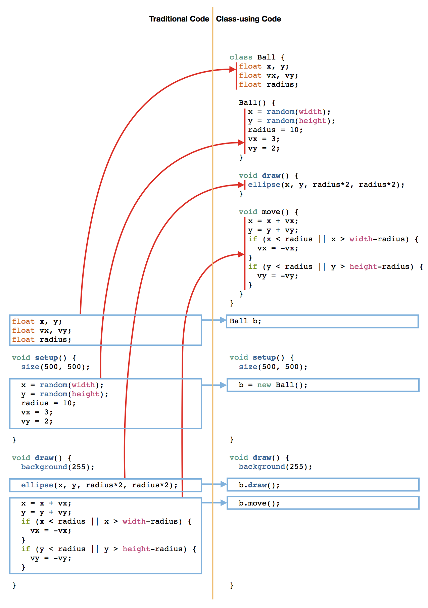
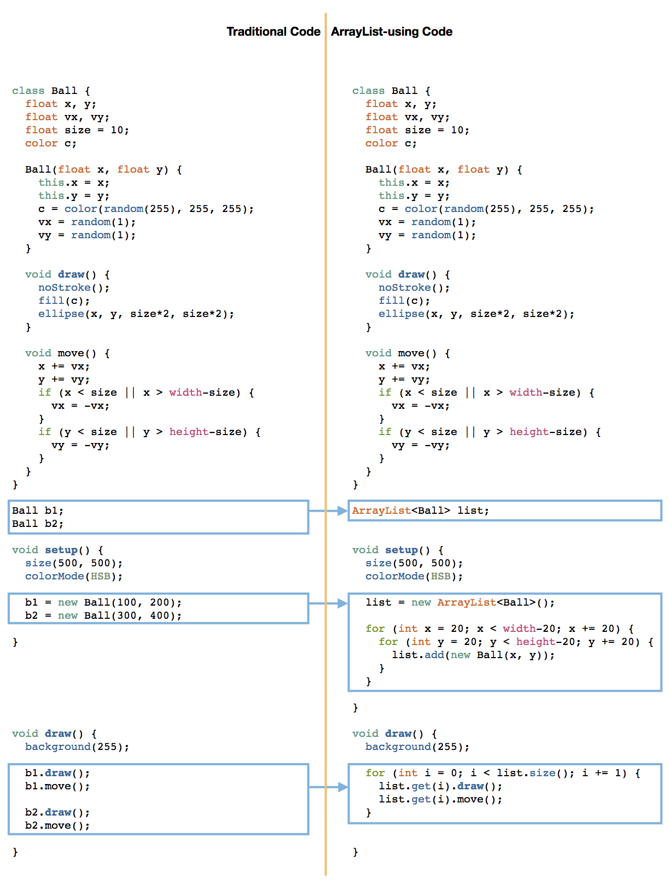

# CCA Programming & Electronics, Fall 2015

This course repository contains homework assignments, useful guides, and code for "Programming & Electronics" at CCA, Fall 2015.

The syllabus for this course is available [in this repository](syllabus.pdf).

### Week 1: Wednesday, September 2, 2015

Lecture:
- Inspirational Videos
- Introductions
- What is programming?
- Goals & course details

Hands-on activities:
- Human Embodiment of Programmer & Robot
  - Programs generally run line-by-line.
  - While loops, if statements, and functions break that up.
  

Videos:
- Basic robots
  - [Coffee-can robot](http://www.youtube.com/watch?v=b0mIshBIbvI#t=24)
  - [Tree-climbing robot](http://www.youtube.com/watch?v=zkpH1BjD6Wc)
  - [Self-balancing robot](http://www.youtube.com/watch?v=Tw9Jr-SPL0Y)
  - [Insect robot](http://www.youtube.com/watch?v=tOsNXg2vAd4#t=120)
  - [Treadbot](http://www.youtube.com/watch?v=YblSltHDbIU)
  - [Velociraptor robot](http://www.youtube.com/watch?v=lPEg83vF_Tw)
- Drink-makers
  - [Textspresso](http://www.youtube.com/watch?v=kx9D74t7GD8#t=89)
  - [The Inebriator](http://www.youtube.com/watch?v=WqY7fchs7H0)
- Art bots
  - [Floating Couch](http://vimeo.com/72826106)
  - [Wooden Segment Mirror](https://www.youtube.com/watch?v=BZysu9QcceM#t=36)
  - [Cubli: Floating Cube](https://www.youtube.com/watch?v=n_6p-1J551Y)
  - [Arc-o-matic](http://vimeo.com/57082262#at=130)
  - [Robo Faber](http://vimeo.com/78771257)
  - [Eggbot](https://www.youtube.com/watch?v=w4cdbV2oaEc)
- Computer Numerical Control (CNC)
  - [Shapoko / tinyg](http://www.youtube.com/watch?v=pCC1GXnYfFI#t=11)
  - [Makerbot Replicator](http://www.youtube.com/watch?v=NAbiAzYhTOQ)
- Music
  - [Laser harp](http://www.youtube.com/watch?v=sLVXmsbVwUs#t=20)
- Vacuuming
  - [Roomba](https://www.youtube.com/watch?v=0DNkbZvVYvc)

[Homework for Week 1](hw/week1.md)


### Week 2: Wednesday, September 9, 2015

Lecture:
- Homework Review

Lab:
- Creating sketches with Processing. Write code to create the following sketches in Processing:

1. 

2. 

3. 

4. [](http://www.youtube.com/watch?v=jWNXFlGHuPA)

5. 

6. Look through the [Processing reference](http://processing.org/reference). Pick a function, and use it in a new sketch of your own choosing.

[Homework for Week 2](hw/week2.md)

### Week 3: Wednesday, September 16, 2015

Lecture:
- Homework Review: understanding & improving code
- Objects!

In today's session, we looked at how you might transform a piece of code that shows a ball bouncing around a screen to use classes. Here's a graphic showing what we did, exactly:



In the diagram above, the blue boxes show the modified code; the left side of each blue box pair shows the traditional code, while the right side shows the class-enabled code that achieves the same effect. The red arrows show where inside the `Ball` class the traditional code goes.

The variables tracking the position, speed, and radius of the ball, as well as the code for drawing and moving the ball, are all put into the class `Ball`. We say that the variables and functions are "encapsulated" in the `Ball` class. In Processing, `Ball` now describes a new type, like `int` or `float`, but more complex, a "compound" type. Whenever we create an "instance" of the `Ball` class, by writing `new Ball()`, we are creating a new **container** object that includes its own `x`, `y`, `vx`, `vy`, and `radius` variables -- the instance we create **contains** those 5 other variables. Then the `draw` and `move` functions are called **on an object**, for example, `b.move()` is the `move` function of the `b` object, it only uses and alters the variables inside the `b` object.

You can create as many instances of a class as you like, giving them different names (for example, `Ball b2 = new Ball()`) or storing them in arrays. Each will be independent, and calling a function on one object will only affect that one object's variable. The class *describes* the object, and the *instance* contains all the data and can have its functions used.

Try it in the homework!

[Homework for Week 3](hw/week3.md)

### Week 4: Wednesday, September 23, 2015

Lecture:
- Homework Review: classes
- Tools for writing code
- Arrays and ArrayLists

In today's session, we looked at how you can use an `ArrayList` object to store large numbers of objects. Here's a graphic showing how we went from two `Ball` objects to 529 `Ball` objects in a grid:



In the diagram above, the blue boxes highlight the changes we made. (Note that the `Ball` class itself hasn't changed! What's changed is how the code keeps track of the `Ball` instances we create.) 

In the traditional code, each ball needs a new variable (`b1` or `b2`, for example). To display 529 `Ball` objects in a grid in the traditional way would require creating 529 `Ball`-type variables -- what a nightmare! Instead, the code creates a new object of type `ArrayList<Ball>`, called `list`, that it'll use to keep track of the 529 `Ball` objects.
  
You can think of an `ArrayList` as a new type of variable that can hold many other variables of the same type. For example, `ArrayList<Ball>` holds `Ball` objects, but `ArrayList<Particle>` would only hold `Particle` objects. If you haven't yet, take a look at the [Processing.org ArrayList reference](https://processing.org/reference/ArrayList.html).
  
The rest of the code interacts with the `ArrayList` object in two ways. First, it uses the `add` function to add `Ball` objects to the list inside of `setup`. Then it picks out those objects using from the `list` using the `get` function to draw and move them. In `setup`, two `for` loops give each `Ball` object its own `x` and `y` position in the grid of balls. In `draw`, a single `for` loop to `draw()` and `move()` each ball.

Lab: 

Write code to create the following sketches in Processing:

1. Animated circle drawing
   
   [](https://youtu.be/35Ohe-EO1Ko)

2. A grid of bouncing circles
   
   [](https://youtu.be/Ida7ntOWq28)
   

[Homework for Week 4](hw/week4.md)


### Week 5: Wednesday, September 30, 2015

Lecture:
- What parts do we need to make Pong?

Lab:
- Add the following to your Paddle assignment from last week:
  - Modify the balls so they bounce off the paddles
  - Create user control. Two options:
    - Make keys on the keyboard control the paddles, or
    - Make the mouse control one of the paddles
  - Add scoring when balls pass the paddles

Here's one possible set of code that implements the three points above, using keyboard control, based on the techniques covered in class: 

```Processing
class Ball {
  float initialX, initialY;
  float x, y;
  float vx, vy;
  float size = 10;
  color c;

  Ball(float x, float y, color c) {
    this.x = initialX = x;
    this.y = initialY = y;
    this.c = c;
    vx = 2+random(1);
    vy = random(1);
  }

  void draw() {
    noStroke();
    fill(c);
    ellipse(x, y, size*2, size*2);
  }
  
  void reset() {
    x = initialX;
    y = initialY;
    vx = 2+random(1);
    if (random(1) < 0.5) {
      vx = -vx;
    }
    vy = random(2) - 1;
  }

  void move() {
    x += vx;
    y += vy;
    if (x < size || x > width-size) {
      vx = -vx;
    }
    if (y < size || y > height-size) {
      vy = -vy;
    }
    if (x-size < leftPaddle.x + leftPaddle.w) {
      if (y > leftPaddle.y &&
          y < leftPaddle.y + leftPaddle.h) {
        vx = -vx;
      } else {
        rightScore++;
        reset();
      }
    }
    if (x+size > rightPaddle.x) {
      if (y > rightPaddle.y &&
          y < rightPaddle.y + rightPaddle.h) {
        vx = -vx;
      } else {
        leftScore++;
        reset();
      }
    }
  }
}

class Paddle {
  float x, y;
  float vy;
  float w = 15, h = 80;
  color c;

  Paddle(float x, float y, color c) {
    this.x = x;
    this.y = y;
    this.c = c;
    vy = 0;
  }

  void draw() {
    noStroke();
    fill(c);
    rect(x, y, w, h);
  }

  void move() {
    y += vy;
    if (y < 0 || y > height-h) {
      vy = 0;
      y = constrain(y, 0, height-h);
    }
  }
}

ArrayList<Ball> list;
Paddle leftPaddle, rightPaddle;
int leftScore = 0;
int rightScore = 0;

void setup() {
  size(500, 500);
  colorMode(HSB);
  list = new ArrayList<Ball>();
  list.add(new Ball(width/2, height/2, color(random(255), 255, 255)));

  leftPaddle = new Paddle(15, 150, color(0));
  rightPaddle = new Paddle(width-15-15, 150, color(0));
}

void drawScores() {
  textSize(32);
  text(""+leftScore, width/2-30, 40);
  text(""+rightScore, width/2+10, 40);
}

void draw() {
  background(255);

  for (int i = 0; i < list.size(); i += 1) {
    list.get(i).draw();
    list.get(i).move();
  }

  leftPaddle.move();
  leftPaddle.draw();
  rightPaddle.move();
  rightPaddle.draw();
  drawScores();
}

void mousePressed() {
  list.add(new Ball(mouseX, mouseY, color(random(255), 255, 255)));
}

void keyPressed() {
  if (key == 'q') {
    leftPaddle.vy = -4;
  }
  if (key == 'a') {
    leftPaddle.vy = 4;
  }
  if (key == 'o') {
    rightPaddle.vy = -4;
  }
  if (key == 'l') {
    rightPaddle.vy = 4;
  }
}

void keyReleased() {
  if (key == 'q' && leftPaddle.vy < 0) {
    leftPaddle.vy = 0;
  }
  if (key == 'a' && leftPaddle.vy > 0) {
    leftPaddle.vy = 0;
  }
  if (key == 'o' && rightPaddle.vy < 0) {
    rightPaddle.vy = 0;
  }
  if (key == 'l' && rightPaddle.vy > 0) {
    rightPaddle.vy = 0;
  }
}
```

Extend this code in the homework!

[Homework for Week 5](hw/week5.md)


### Week 6: Wednesday, October 7, 2015

Lecture:
- Arduino introduction (slides available in [pdf](img/arduino-slides.pdf))

Lab:
- Building circuits with Arduino and other electronic components!

[Homework for Week 6](hw/week6.md)


