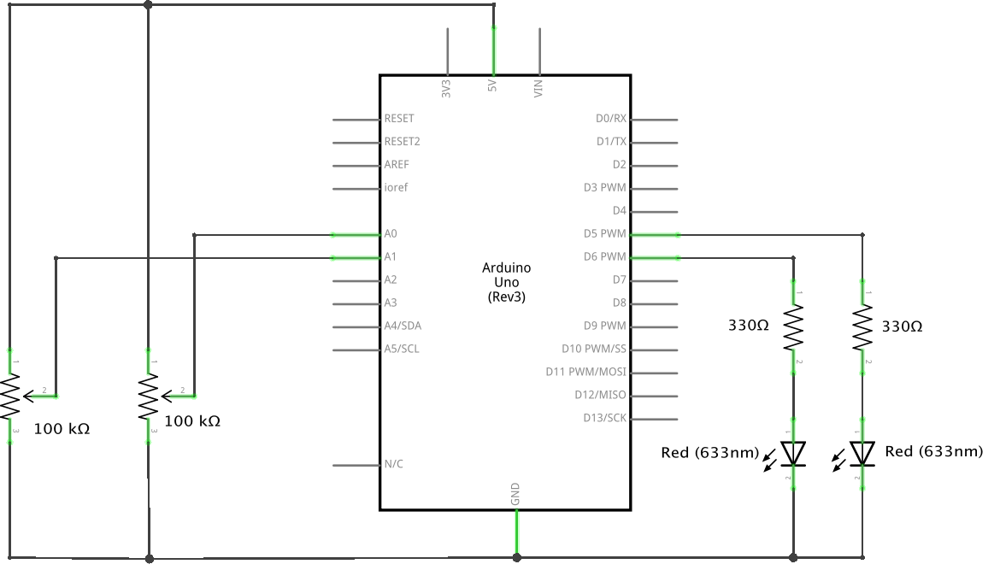

### Homework 7

**This homework is one programming practice due Sunday, and one electronics assignment due Tuesday.**

#### Programming Practice (due Sunday, October 18, 2015)

**Assignemnt**: Starting from the following sketch, [*Fireworks*](fireworks.pde), choose two of the following changes to make:

1. Increase "gravity" so that the stars fall down faster. 

2. Increase the lifetime of the stars: make them last at least 8 seconds.  

3. Stop the stars from moving when you hold down a key.  

4. Change the four-pointed shape of the stars to be 7-pointed    

5. Change how stars are created: instead of immediately creating a set of five stars when you click, animate a small white circle launching from the bottom of the canvas to where you clicked, and create several bunches of stars when the circle reaches the click point.     

6. Create a fireworks show by randomly creating larger groups of similarly-colored or color-coordinated stars over time.   

7. Add a second kind of star shape; have the stars created by clicking be a different shape from those created by moving the mouse.   

As usual, make a new repository and place your code (with the `.pde` extension!) in it.

(Hardness Icon  by AhaSoft)

#### Electronics (due Tuesday, October 20, 2015)

This assignment has two parts:

1. **Assignment**: Build the following schematic on your breadboard and bring it to class on Wednesday. You will need it for the in-class activities!
   
   

2. Read [this Sparkfun tutorial](https://www.sparkfun.com/tutorials/219) on how to pair a resistor value with an LED; **assignment:** [email me](mailto:jzamfirescupereira@cca.edu) ([jzamfirescupereira@cca.edu](mailto:jzamfirescupereira@cca.edu)) answers to the following questions:
  1. With a typical red LED, you have a forward voltage drop of 2.0V and a forward current of 20mA. An Arduino supplies 5V. What value of resistor should you use to get 2.0V across and 20mA through your LED?
  2. How much power is dissipated in that LED?
  3. How much power is dissipated in that resistor?